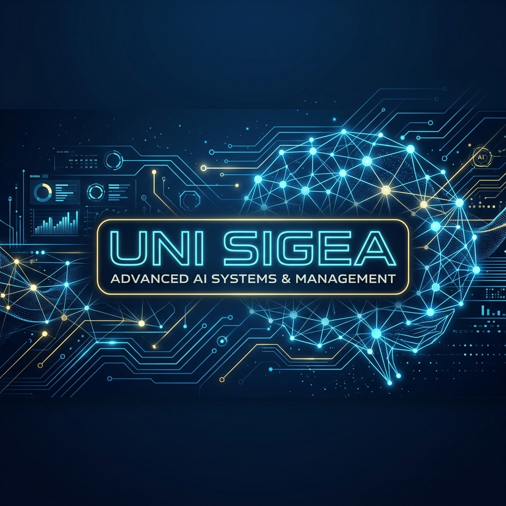
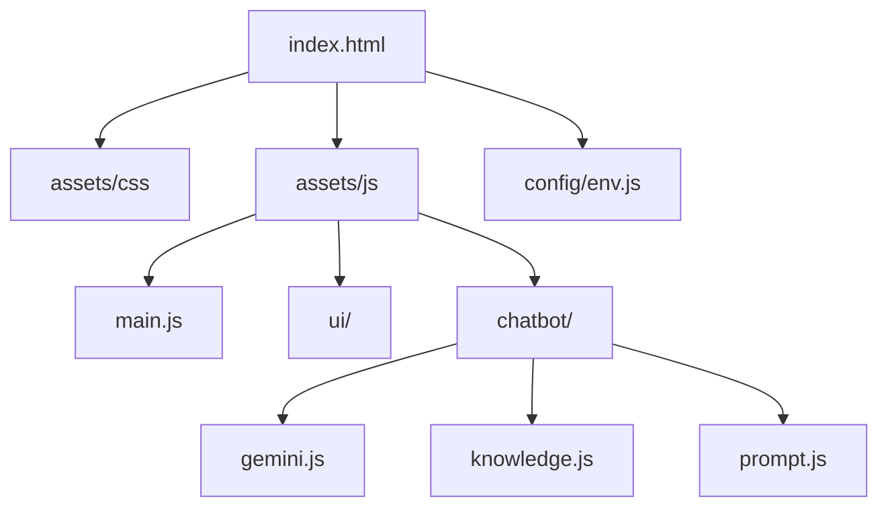

<div align="center">
  
  
  # 🏛️ UNI SIGEA
  ### **Sistema de Gestión Inteligente para Educación y Administración Universitaria**
  
  [](https://ai.google.dev/)
  [](LICENSE)
  [](https://developer.mozilla.org/)

**Transformando la gestión universitaria mediante innovación y tecnología.**

</div>

---

## 🌟 Visión General

**UNI SIGEA** es una plataforma de vanguardia orientada a la gestión inteligente de convocatorias, talento humano y procesos académicos. Diseñada con un enfoque futurista y minimalista, centraliza la administración universitaria, permitiendo una toma de decisiones basada en datos y automatización inteligente.

> [!TIP]
> El proyecto incluye un **Asistente Virtual (Chatbot)** bilingüe integrado, capaz de responder dudas institucionales en tiempo real utilizando la tecnología de **Google Gemini 1.5 Flash**.

---

## 🚀 Características Principales

| Módulo                          | Descripción                                                               |
| :------------------------------ | :------------------------------------------------------------------------ |
| **📢 Gestión de Convocatorias** | Publicación, requisitos y seguimiento de procesos académicos y laborales. |
| **👥 Usuarios y Roles**         | Control de acceso granular para administradores, docentes y estudiantes.  |
| **📄 Validación de Documentos** | Carga y verificación inteligente de requisitos documentales.              |
| **🔍 Seguimiento (Tracking)**   | Monitoreo en tiempo real de cada etapa de las postulaciones.              |
| **📊 Panel Administrativo**     | Dashboard con analítica, informes y métricas institucionales.             |
| **🤖 IA Chatbot**               | Soporte interactivo bilingüe (ES/EN) con base de conocimiento propia.     |

---

## 🛠️ Stack Tecnológico

El proyecto se destaca por su ligereza y alto rendimiento al no utilizar frameworks externos pesados:

- **Frontend**: HTML5 Semántico, CSS3 (Variables, Flexbox, Grid, Animaciones LED).
- **Lógica**: JavaScript Vanilla (ES Modules).
- **Inteligencia Artificial**: API de Google Gemini 1.5 Flash (REST integration).
- **Diseño**: Tipografías Orbitron, Exo 2 y JetBrains Mono.

---

## 📂 Arquitectura del Proyecto



---

## 🔧 Configuración e Instalación

Para ejecutar el proyecto localmente, sigue estos pasos:

1.  **Clonar el repositorio:**

    ```bash
    git clone https://github.com/tu-usuario/uni-sigea.git
    cd uni-sigea
    ```

2.  **Configurar Variables de Entorno:**
    Crea un archivo `config/env.js` basado en el siguiente ejemplo:

    ```javascript
    window.__ENV__ = {
      GEMINI_API_KEY: "TU_API_KEY_AQUI",
      GEMINI_MODEL: "gemini-1.5-flash-latest",
      GEMINI_API_URL: "https://generativelanguage.googleapis.com/v1beta/models",
    };
    ```

3.  **Ejecutar Servidor Local:**
    Usa cualquier servidor estático (ej: Live Server de VS Code o Python):
    ```bash
    python -m http.server 8080
    ```

---

## 📜 Compromiso Ético

**"Soy LIBRE, AUTÓNOMO Y RESPONSABLE a través del diálogo y la construcción."**

UNI SIGEA integra la filosofía de la **Persona Transhumana**, promoviendo el desarrollo humano, la autonomía y la transformación social positiva a través de la tecnología.

---

## 👨‍💻 Autores

**Juan Esteban Acosta Santana y **
**Julian Mateo Acosta Santana**  
_Estudiantes de Ingeniería de Sistemas y Computación_  
Universidad de Cundinamarca (8° semestre)

---

<div align="center">
  <sub>© 2026 UNI SIGEA. Proyecto académico con fines de innovación universitaria.</sub>
</div>
